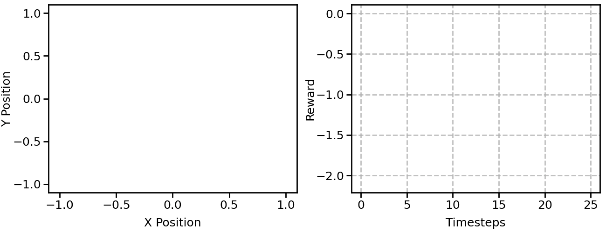

# 1 Installation instructions


## 1.1 Install StarCraftII ans SMAC
```shell
cd HAVE_SMAC
bash install_sc2.sh
```
This will download SC2 into the 3rdparty folder and copy the maps necessary to run over.

## 1.2 Install PyTorch and other Python packages
```shell
chmod +x install_dependencies.sh
./install_dependencies.sh
```

# 2 Quick Demos on MPE and SMAC
We provide a pretrained model and easy-to-run Python scripts for quick demos of the HAVE.

## 2.1 MPE
HAVE_MPE is based on [EPyMARL v1.0](https://github.com/uoe-agents/epymarl)


<table>
  <tr>
    <td></td>
    <td></td>
  </tr>
</table>

#### Fig. 1. 5CN and 20CN (Purple circle denotes agent and semi-transparent black circle denotes landmark)

<table>
  <tr>
    <td></td>
    <td></td>
  </tr>
</table>

#### Fig. 2. 5vs2PP and 20vs15PP (Purple circle denotes predator and black circle denotes prey. The prey is faster than the predator.)

For MPE, take the 5cn_label task as an example.
```shell
cd have/HAVE_MPE
```

### I. Test in the 5CN task
```shell
python src/main.py --config=have --env-config=5cn_label with checkpoint_path=results/models/have_5cn_label/ evaluate=True runner=gymma_episode batch_size_run=1
```

### II. Render in the 5CN task


```shell
python src/main.py --config=have --env-config=5cn_label with checkpoint_path=results/models/have_5cn_label/ evaluate=True runner=gymma_episode batch_size_run=1 render=True
```

### III. Animation in the 5CN task

#### Fig. 3. 5CN
<table>
  <tr>
    <td></td>
  </tr>
</table>

```shell
python src/main.py --config=have --env-config=5cn_label with checkpoint_path=results/models/have_5cn_label/ evaluate=True runner=gymma_episode batch_size_run=1 render=True save_animation=True
```


## 2.2 SMAC
HAVE_SMAC is based on [pymarl3](https://github.com/tjuHaoXiaotian/pymarl3)

For SMAC, take the MMM2 map as an example.
```shell
cd have/HAVE_SMAC
```

### I. Test in the MMM2 task
```shell
CUDA_VISIBLE_DEVICES="0" python src/main.py --config=have --env-config=sc2 with env_args.map_name=MMM2 checkpoint_path=results/models/have_MMM2 evaluate=True runner=episode batch_size_run=1
```
### II. Save replay in the MMM2 task


<table>
  <tr>
    <td></td>
    <td></td>
  </tr>
</table>

#### Fig. 4. MMM and MMM2 (On the left are the units controlled by HAVE, and on the right are the units controlled by the built-in AI.)

```shell
CUDA_VISIBLE_DEVICES="0" python src/main.py --config=have --env-config=sc2 with env_args.map_name=MMM2 checkpoint_path=results/models/have_MMM2 evaluate=True runner=episode batch_size_run=1 save_replay=True
```

# 3 Reproduce experimental results on MPE and SMAC
## 3.1 Detailed command lines to reproduce experimental results on MPE


For MPE, take the 5cn_label, 20cn_label, 5vs2pp_label and 20vs15pp_label tasks as an example.

```shell
cd have/HAVE_MPE
```
### I. Train
Train in the 5CN task

```shell
python src/main.py --config=have --env-config=5cn_label
```

Train in the 20CN task

```shell
python src/main.py --config=have --env-config=20cn_label
```

Train in the 5vs2PP task

```shell
python src/main.py --config=have --env-config=5vs2pp_label
```

Train in the 20vs15PP task

```shell
python src/main.py --config=have --env-config=20vs15pp_label
```

### II. Task Transfer
### Phase 1: Training in 5CN
Taking the 5cn label as an example for training, we set the timesteps to 1M. In our experiments, HAVE is able to achieve a performance close to 100% at the 1M time step
```shell
python src/main.py --config=have --env-config=5cn_label t_max=1050000
```
#### Note1:
After running the command, the command line will output the path where the model is stored, for example: `[INFO 07:17:00] my_main Saving models to results/models/have_seed896818870_cooperative_navigation_label_2025-05-10 07:16:54.039996/200`. We need to record the storage path of the model `results/models/have_seed896818870_cooperative_navigation_label_2025-05-10 07:16:54.039996`, and load the model after the training is completed

#### Note2:
Task Transfer from 5CN to 20CN or 5CN to 20vs15PP, where t_max must be greater than 1050000. Note that when a path contains spaces or special characters (such as the colon `:`), a backslash `\` must be added before these characters to escape them, in order to prevent the command line or program from misinterpreting the path

#### Note3:
Ensure that we can load the parameters of the policy and mixing into the model. Check whether the `load_models` function in `src/learners/nq_have_learner` is correct, as shown below:
```python
def load_models(self, path):
    self.mac.load_models(path)
    # Not quite right but I don't want to save target networks
    self.target_mac.load_models(path)
    if self.mixer is not None:
        self.mixer.load_state_dict(th.load("{}/mixer.th".format(path), map_location=lambda storage, loc: storage))
        self.target_mixer.load_state_dict(th.load("{}/mixer.th".format(path), map_location=lambda storage, loc: storage))
    self.optimiser.load_state_dict(th.load("{}/opt.th".format(path), map_location=lambda storage, loc: storage))
```
This is because in the commonly used PyMARL/PyMARL2/PyMARL3/EPyMARL framework, the parameters of the `target_mixer` are not loaded.

### Phase 2: Task Transfer to 20CN or 20vs15PP

Task Transfer from 5CN to 20CN:
```shell
python src/main.py --config=have --env-config=20cn_label with checkpoint_path=results/models/have_seed896818870_cooperative_navigation_label_2025-05-10\ 07\:16\:54.039996/ t_max=2050000
```

Task Transfer from 5CN to 20vs15PP:
```shell
python src/main.py --config=have --env-config=20vs15pp_label with checkpoint_path=results/models/have_seed896818870_cooperative_navigation_label_2025-05-10\ 07\:16\:54.039996/ t_max=2050000
```

## 3.2 Detailed command lines to reproduce experimental results on SMAC.

For SMAC, take the MMM2 map as an example.
```shell
cd have/HAVE_SMAC
```

### I. Train

Train in the MMM task

```shell
CUDA_VISIBLE_DEVICES="0" python src/main.py --config=have --env-config=sc2 with env_args.map_name=MMM
```

Train in the MMM2 task

```shell
CUDA_VISIBLE_DEVICES="0" python src/main.py --config=have --env-config=sc2 with env_args.map_name=MMM2
```

Train in the 5s10z task

```shell
CUDA_VISIBLE_DEVICES="0" python src/main.py --config=have --env-config=sc2 with env_args.map_name=5s10z
```

Train in the 32m task

```shell
CUDA_VISIBLE_DEVICES="0" python src/main.py --config=have --env-config=sc2 with env_args.map_name=32m
```


### II. Task Transfer
Taking the task transfer from MMM to MMM2 as an example for training, we set the timesteps to 1M.

### Phase 1: Training in MMM
```shell
python src/main.py --config=have --env-config=sc2 with env_args.map_name=MMM t_max=1050000
```

#### Note1:
After running the command, the command line will output the path where the model is stored, for example: `[INFO 07:17:00] my_main Saving models to results/models/have_seed896818870_cooperative_navigation_label_2025-05-10 07:16:54.039996/200`. We need to record the storage path of the model `results/models/have_seed317349183_MMM_2025-05-07 12:38:42.534416`, and load the model after the training is completed.
#### Note2:
Task Transfer from MMM to MMM2, where t_max must be greater than 1050000. Note that when a path contains spaces or special characters (such as the colon `:`), a backslash `\` must be added before these characters to escape them, in order to prevent the command line or program from misinterpreting the path.
#### Note3:
Ensure that we can load the parameters of the policy and mixing into the model. Check whether the `load_models` function in `src/learners/nq_have_learner` is correct, as shown below:
```python
def load_models(self, path):
    self.mac.load_models(path)
    # Not quite right but I don't want to save target networks
    self.target_mac.load_models(path)
    if self.mixer is not None:
        self.mixer.load_state_dict(th.load("{}/mixer.th".format(path), map_location=lambda storage, loc: storage))
        self.target_mixer.load_state_dict(th.load("{}/mixer.th".format(path), map_location=lambda storage, loc: storage))
    self.optimiser.load_state_dict(th.load("{}/opt.th".format(path), map_location=lambda storage, loc: storage))
```
This is because in the commonly used PyMARL/PyMARL2/PyMARL3/EPyMARL framework, the parameters of the `target_mixer` are not loaded.


### Phase 2: Task Transfer to MMM2

```shell
python src/main.py --config=have --env-config=sc2 with env_args.map_name=MMM2 checkpoint_path=results/models/have_seed317349183_MMM_2025-05-07\ 12\:38\:42.534416 t_max=2050000
```

### Note: joint observation and global states
In the experiment of SMAC, we use joint observation for training the mixing network. If you want to use the global state, please ensure that the following code is correct: `have/HAVE_SMAC/src/envs/smac_v1/official/starcraft2.py` line 1136, 
```shell
def get_state(self):
    if self.obs_instead_of_state:
        ...
    ...
    return state
```

`have/HAVE_SMAC/src/envs/smac_v1/official/starcraft2.py` Line 1326,
```shell
def get_state_size(self):
    if self.obs_instead_of_state:
      ...
    ...
    return size
```
If the global state is used, the mixing network must use QMIX. You need to ensure that `mixer: "qmix"` in `have/HAVE_SMAC/src/config/algs/have.yaml`.

# License
All the source code that has been taken from the PyMARL repository was licensed (and remains so) under the Apache License v2.0 (included in `LICENSE` file).
Any new code is also licensed under the Apache License v2.0
